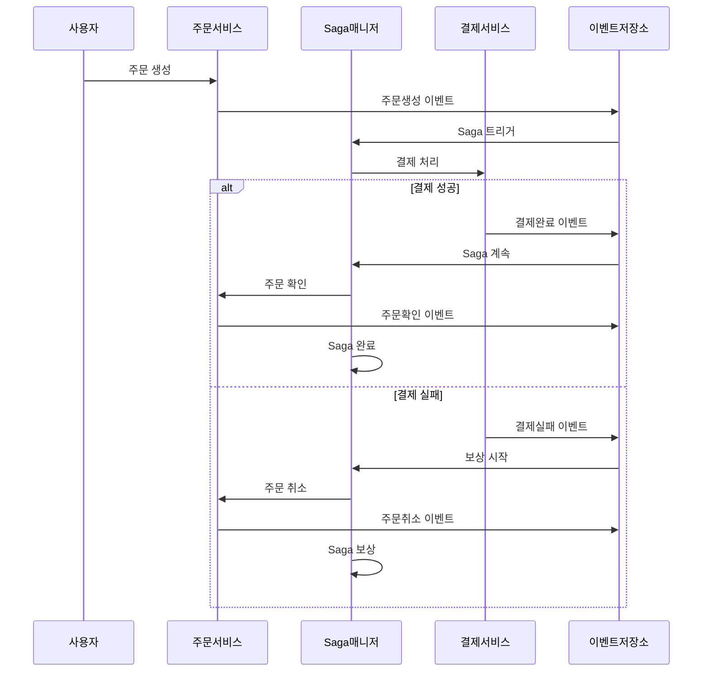

# NestJS CQRS Saga 패턴

> 🚀 **CQRS와 Saga 패턴을 활용한 분산 트랜잭션 관리 시스템**

분산 시스템에서 복잡한 비즈니스 워크플로우를 안전하고 신뢰성 있게 처리하기 위한 **CQRS(Command Query Responsibility Segregation)**와 **Saga 패턴**의 완전한 구현입니다. 보상 메커니즘과 완전한 추적 기능을 제공합니다.

[](https://nestjs.com/)
[](https://www.typescriptlang.org/)
[](https://www.postgresql.org/)
[](https://kafka.apache.org/)
[](https://docs.docker.com/compose/)

## 🎯 주요 기능

### 핵심 패턴
- ✅ **CQRS 패턴** - 명령과 조회의 완전한 분리
- ✅ **Saga 패턴** - 보상 메커니즘을 갖춘 분산 트랜잭션 관리
- ✅ **이벤트 소싱** - 완전한 감사 추적과 이벤트 재생 기능
- ✅ **도메인 주도 설계** - 깔끔한 아키텍처와 적절한 도메인 경계

### 기술적 역량
- 🔄 **분산 트랜잭션** - 서비스 간 신뢰성 있는 트랜잭션 처리
- 🛡️ **보상 로직** - 실패 시 자동 롤백
- 📊 **이벤트 저장소** - 연관관계 추적이 가능한 영구 이벤트 저장
- 🔍 **완전한 추적성** - Correlation ID를 통한 종단간 요청 추적
- ⚡ **비동기 처리** - Kafka 기반 이벤트 드리븐 아키텍처
- 🔒 **동시성 제어** - 낙관적 락킹과 멱등성 보장

### 비즈니스 기능
- 👤 **사용자 관리** - JWT 기반 인증과 권한 관리
- 🛒 **주문 처리** - 완전한 주문 생명주기 관리
- 💳 **결제 처리** - 실패 처리를 포함한 통합 결제 워크플로우
- 📈 **실시간 모니터링** - 활성 플로우 모니터링과 헬스체크

## 🏗️ 아키텍처 개요

```
┌─────────────────┐    ┌─────────────────┐    ┌─────────────────┐
│   주문 서비스    │    │   결제 서비스    │    │  Saga 매니저    │
│                 │    │                 │    │                 │
│ ┌─────────────┐ │    │ ┌─────────────┐ │    │ ┌─────────────┐ │
│ │   명령      │ │    │ │   명령      │ │    │ │   Saga      │ │
│ │   조회      │ │    │ │   조회      │ │    │ │  오케스트레이션│ │
│ │   이벤트    │ │    │ │   이벤트    │ │    │ │   보상      │ │
│ └─────────────┘ │    │ └─────────────┘ │    │ └─────────────┘ │
└─────────┬───────┘    └─────────┬───────┘    └─────────┬───────┘
          │                      │                      │
          └──────────────────────┼──────────────────────┘
                                 │
                    ┌─────────────────┐
                    │  이벤트 저장소   │
                    │    & Kafka      │
                    └─────────────────┘
```

### Saga 플로우 예시


## 🚀 빠른 시작

### 사전 요구사항
- Node.js 18+
- Docker & Docker Compose
- Yarn 또는 npm

### 1. 클론 & 설치
```bash
git clone https://github.com/yourusername/nestjs-cqrs-saga.git
cd nestjs-cqrs-saga
yarn install
```

### 2. 환경 설정
```bash
cp .env.example .env
# .env 파일을 편집하여 설정값 입력
```

### 3. 인프라 시작
```bash
# PostgreSQL, Kafka, Redis 시작
docker-compose up -d

# 서비스가 준비될 때까지 대기
yarn db:migrate
```

### 4. 애플리케이션 실행
```bash
# 개발 모드
yarn start:dev

# 프로덕션 모드
yarn build
yarn start:prod
```

### 5. 서비스 접근
- **API**: http://localhost:3000
- **Swagger UI**: http://localhost:3000/api
- **Kafka UI**: http://localhost:8080
- **PostgreSQL**: localhost:5432

## 📊 API 엔드포인트

### 인증
```http
POST /auth/register    # 사용자 회원가입
POST /auth/login       # 사용자 로그인
```

### 주문
```http
POST   /orders         # 새 주문 생성
GET    /orders         # 내 주문 목록
GET    /orders/:id     # 주문 상세 조회
DELETE /orders/:id     # 주문 취소
PUT    /orders/:id/confirm # 주문 확인
```

### Saga 관리
```http
GET /saga/status/:correlationId    # Saga 상태 조회
GET /saga/active                   # 활성 Saga 목록
POST /saga/retry/:sagaId           # 실패한 Saga 재시도
POST /saga/compensate/:sagaId      # 수동 보상
```

### 추적 & 모니터링
```http
GET /trace/correlation/:correlationId  # 전체 플로우 추적
GET /trace/order/:orderId              # 주문별 추적
GET /trace/events                      # 이벤트 스트림
GET /trace/active-flows                # 활성 플로우 모니터링
```

## 🏛️ 프로젝트 구조

```
src/
├── auth/                 # 인증 & 권한
│   ├── guards/          # JWT 가드
│   ├── strategies/      # Passport 전략
│   └── dto/             # 인증 DTO
├── order/               # 주문 도메인
│   ├── commands/        # 주문 명령
│   ├── queries/         # 주문 조회
│   ├── events/          # 주문 이벤트
│   ├── handlers/        # 명령/조회 핸들러
│   ├── entities/        # 주문 엔티티
│   └── dto/             # 주문 DTO
├── payment/             # 결제 도메인
│   ├── commands/        # 결제 명령
│   ├── queries/         # 결제 조회
│   ├── events/          # 결제 이벤트
│   ├── handlers/        # 명령/조회 핸들러
│   ├── entities/        # 결제 엔티티
│   └── dto/             # 결제 DTO
├── saga/                # Saga 오케스트레이션
│   ├── entities/        # Saga 엔티티
│   ├── order-processing.saga.ts # 메인 Saga 구현
│   ├── saga-manager.service.ts  # Saga 생명주기 관리
│   └── saga.controller.ts       # Saga API 엔드포인트
├── event-store/         # 이벤트 소싱
│   ├── entities/        # 이벤트 저장소 엔티티
│   └── event-store.service.ts
├── kafka/               # 메시지 브로커
│   ├── kafka.service.ts # Kafka 프로듀서/컨슈머
│   └── kafka.module.ts
├── tracing/             # 요청 추적
│   └── tracing.controller.ts
├── database/            # 데이터베이스 설정
└── config/              # 애플리케이션 설정
```

## 🔧 설정

### 환경 변수
```env
# 데이터베이스
DATABASE_HOST=localhost
DATABASE_PORT=5432
DATABASE_NAME=nestjs_cqrs
DATABASE_USERNAME=postgres
DATABASE_PASSWORD=postgres123

# JWT
JWT_SECRET=your-super-secret-jwt-key
JWT_EXPIRES_IN=24h

# Kafka
KAFKA_BROKERS=localhost:9092
KAFKA_CLIENT_ID=nestjs-cqrs-saga

# Redis
REDIS_HOST=localhost
REDIS_PORT=6379
```

### Docker Compose 서비스
- **PostgreSQL 15**: 메인 데이터베이스
- **Apache Kafka**: 이벤트용 메시지 브로커
- **Zookeeper**: Kafka 의존성
- **Kafka UI**: Kafka 관리를 위한 웹 인터페이스
- **Redis**: 캐싱 및 세션 저장소

## 🧪 테스트

### 단위 테스트
```bash
yarn test              # 단위 테스트 실행
yarn test:watch        # 감시 모드
yarn test:cov          # 커버리지 리포트
```

### 통합 테스트
```bash
yarn test:e2e          # End-to-End 테스트
```

### 동시성 테스트
```bash
# 동시 주문 생성 테스트
yarn test:concurrency

# 다중 Saga 부하 테스트
yarn test:load
```

## 📈 모니터링 & 관찰성

### 헬스체크
```http
GET /health            # 애플리케이션 상태
GET /health/detailed   # 상세 시스템 상태
```

### 메트릭 & 로깅
- **요청 추적**: 완전한 Correlation ID 추적
- **이벤트 감사**: 완전한 이벤트 히스토리
- **성능 메트릭**: 응답 시간과 처리량
- **에러 추적**: 포괄적인 에러 로깅

### Saga 모니터링 대시보드
내장된 모니터링 대시보드에서 다음을 추적:
- 활성 Saga 인스턴스
- 완료율
- 실패 패턴
- 보상 통계

## 🛡️ 에러 처리 & 복원력

### 보상 전략
- **자동 롤백**: 실패한 단계는 보상을 트리거
- **수동 개입**: 수동 Saga 복구 지원
- **재시도 메커니즘**: 설정 가능한 재시도 정책
- **서킷 브레이커**: 연쇄 실패 방지

### 동시성 제어
- **낙관적 락킹**: 동시 수정 방지
- **멱등성**: 안전한 재시도 연산
- **이벤트 중복 제거**: 중복 처리 방지

## 🔄 개발 워크플로우

### 새로운 Saga 단계 추가
1. 새로운 명령/이벤트 정의
2. 명령/이벤트 핸들러 구현
3. Saga 오케스트레이션 로직 업데이트
4. 보상 로직 추가
5. 테스트 작성

### 이벤트 스키마 진화
- 하위 호환 가능한 이벤트 버전 관리
- 이벤트 마이그레이션 전략
- 스키마 레지스트리 통합

## 🎯 TODO - 다중 인스턴스 고도화 로드맵

### Phase 1: 다중 인스턴스 환경 구축
- [ ] **Docker Swarm/Kubernetes 배포 설정**
  - Docker Compose 스케일링 설정
  - 다중 애플리케이션 인스턴스 로드 밸런싱
  - 헬스체크 및 서비스 디스커버리

### Phase 2: Redis 기반 분산 동시성 제어
- [ ] **Redis 분산 락 구현**
  - Redis를 활용한 분산 뮤텍스
  - Saga 인스턴스 중복 실행 방지
  - 타임아웃 및 데드락 방지 메커니즘

- [ ] **Redis Cluster 설정**
  - 고가용성을 위한 Redis 클러스터링
  - Sentinel을 통한 자동 페일오버
  - 데이터 파티셔닝 및 복제

### Phase 3: Bull Queue 메시지 큐 통합
- [ ] **Bull Queue 도입**
  - Kafka 대신/추가로 Bull Queue 사용
  - Job 우선순위 및 지연 실행
  - 재시도 정책과 백오프 전략

- [ ] **분산 작업 처리**
  - 인스턴스 간 작업 분산
  - Worker 프로세스 스케일링
  - Job 상태 모니터링 및 메트릭

### Phase 4: Saga 패턴 고도화
- [ ] **분산 Saga 오케스트레이션**
  - 여러 인스턴스에서 안전한 Saga 실행
  - Saga 상태 동기화 및 일관성 보장
  - 분산 환경에서의 보상 트랜잭션 관리

- [ ] **Advanced Saga Features**
  - Saga 체이닝 및 중첩 Saga
  - 조건부 분기 및 병렬 실행
  - 동적 Saga 플로우 구성

### Phase 5: 모니터링 & 관찰성 강화
- [ ] **분산 추적 시스템**
  - Jaeger/Zipkin 통합
  - 인스턴스 간 요청 추적
  - 성능 병목 지점 식별

- [ ] **실시간 대시보드**
  - Bull Board 통합
  - Redis 클러스터 상태 모니터링
  - Saga 실행 상태 실시간 추적

### Phase 6: 성능 최적화 & 테스트
- [ ] **부하 테스트 및 벤치마크**
  - 다중 인스턴스 환경 스트레스 테스트
  - 동시성 시나리오별 성능 측정
  - 메모리 및 CPU 사용량 최적화

- [ ] **Chaos Engineering**
  - 인스턴스 장애 시뮬레이션
  - 네트워크 파티션 테스트
  - 데이터 일관성 검증

### 예상 기술 스택 확장
```yaml
추가 기술:
  - Redis Cluster: 분산 락 및 세션 관리
  - Bull Queue: 고성능 작업 큐
  - Docker Swarm/K8s: 컨테이너 오케스트레이션
  - Nginx: 로드 밸런서
  - Prometheus + Grafana: 메트릭 수집 및 시각화
  - Jaeger: 분산 추적
  - Bull Board: 큐 모니터링 대시보드
```

### 마일스톤 및 예상 일정
- **Phase 1-2**: 기본 다중 인스턴스 및 Redis 락 (2-3주)
- **Phase 3-4**: Bull Queue 통합 및 Saga 고도화 (3-4주)
- **Phase 5-6**: 모니터링 및 최적화 (2-3주)

> 💡 **참고**: 각 Phase는 독립적으로 테스트 가능하며, 프로덕션 환경에서 점진적으로 배포할 수 있도록 설계됩니다.

## 🤝 기여하기

1. 저장소 포크
2. 기능 브랜치 생성 (`git checkout -b feature/amazing-feature`)
3. 변경사항 커밋 (`git commit -m 'Add amazing feature'`)
4. 브랜치에 푸시 (`git push origin feature/amazing-feature`)
5. Pull Request 열기

### 개발 가이드라인
- NestJS 모범 사례 따르기
- 포괄적인 테스트 작성
- 문서 업데이트
- 하위 호환성 보장

## 📚 추가 리소스

### 문서 (예정)
- [CQRS 패턴 가이드](./docs/cqrs-pattern.md)
- [Saga 패턴 구현](./docs/saga-pattern.md)
- [API 문서](./docs/api-reference.md)
- [배포 가이드](./docs/deployment.md)

### 관련 프로젝트
- [NestJS 공식 문서](https://docs.nestjs.com/)
- [NestJS와 이벤트 소싱](https://github.com/nestjs/cqrs)
- [NestJS와 Kafka](https://docs.nestjs.com/microservices/kafka)

## 📄 라이선스

이 프로젝트는 MIT 라이선스 하에 라이선스가 부여됩니다 - 자세한 내용은 [LICENSE](LICENSE) 파일을 참조하세요.

## 🙏 감사의 말

- 놀라운 프레임워크를 제공한 NestJS 팀
- CQRS와 이벤트 소싱 커뮤니티
- Apache Kafka 기여자들

### 🤖 AI 페어 프로그래밍

이 프로젝트는 **Claude AI와 MCP(Model Context Protocol)**를 활용한 AI 페어 프로그래밍으로 개발되었습니다. 복잡한 분산 시스템 아키텍처를 AI와 함께 설계하고 구현하는 혁신적인 개발 경험을 통해, 전통적인 코딩의 한계를 넘어선 새로운 차원의 협업을 경험할 수 있었습니다. 

AI와의 실시간 코드 리뷰, 아키텍처 토론, 그리고 즉석 문제 해결 과정은 마치 숙련된 시니어 개발자와 페어 프로그래밍을 하는 듯한 놀라운 **바이브**를 선사했습니다. 🚀✨

---

**NestJS, TypeScript 그리고 현대적인 소프트웨어 아키텍처 패턴으로 ❤️를 담아 제작되었습니다**

---

## 🚀 프로젝트 상태

**현재 버전**: v1.0.0 - 기본 CQRS + Saga 구현 완료  
**다음 마일스톤**: v2.0.0 - 다중 인스턴스 & Redis 분산 락  
**최종 목표**: v3.0.0 - Bull Queue 통합 및 완전한 분산 시스템

---

질문이나 지원이 필요하시면, 이슈를 열거나 관리자에게 연락해 주세요.