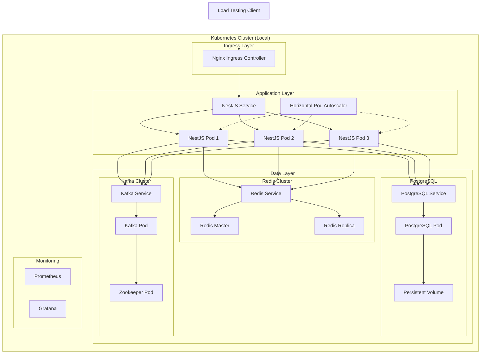

# Kubernetes 환경 구성 로드맵

## v2.5.0: Kubernetes 로컬 환경 구성

### 📋 목표
Docker Compose에서 검증된 NestJS CQRS Saga 시스템을 Kubernetes 환경으로 마이그레이션하여 더욱 현실적인 프로덕션 환경에서 테스트

### 🏗️ 아키텍처 설계



### 📁 K8s 매니페스트 구조

```
k8s/
├── namespace.yaml
├── configmaps/
│   ├── app-config.yaml
│   ├── nginx-config.yaml
│   └── postgres-init.yaml
├── secrets/
│   ├── postgres-secret.yaml
│   └── redis-secret.yaml
├── infrastructure/
│   ├── postgres/
│   │   ├── postgres-pvc.yaml
│   │   ├── postgres-deployment.yaml
│   │   └── postgres-service.yaml
│   ├── redis/
│   │   ├── redis-master.yaml
│   │   ├── redis-replica.yaml
│   │   └── redis-service.yaml
│   └── kafka/
│       ├── zookeeper.yaml
│       ├── kafka-deployment.yaml
│       └── kafka-service.yaml
├── application/
│   ├── nestjs-deployment.yaml
│   ├── nestjs-service.yaml
│   ├── nestjs-hpa.yaml
│   └── nestjs-ingress.yaml
├── monitoring/
│   ├── prometheus/
│   └── grafana/
└── scripts/
    ├── deploy.sh
    ├── scale-test.sh
    └── cleanup.sh
```

### 🔧 구현 단계

#### Phase 1: 기본 인프라 구성 (1-2일)
- [ ] **Namespace 및 기본 리소스**
  - Namespace 생성
  - ConfigMaps, Secrets 구성
  - 네트워크 정책 설정

- [ ] **데이터베이스 계층**
  - PostgreSQL StatefulSet 구성
  - Persistent Volume 설정
  - 초기 데이터 마이그레이션

- [ ] **Redis 클러스터**
  - Redis Master/Replica 구성
  - Redis Sentinel (선택사항)
  - 분산 락 테스트

#### Phase 2: 메시징 시스템 (1-2일)
- [ ] **Kafka 클러스터**
  - Zookeeper StatefulSet
  - Kafka Broker 구성
  - Topic 자동 생성 설정

- [ ] **서비스 디스커버리**
  - 각 컴포넌트별 Service 정의
  - DNS 기반 서비스 발견 검증

#### Phase 3: 애플리케이션 배포 (2-3일)
- [ ] **NestJS 애플리케이션**
  - Deployment 매니페스트 작성
  - 환경변수 및 설정 주입
  - 헬스체크 설정 (Liveness, Readiness)

- [ ] **로드 밸런싱**
  - Service 구성 (ClusterIP)
  - Ingress Controller 설정
  - 트래픽 분산 검증

#### Phase 4: 오토스케일링 & 모니터링 (2-3일)
- [ ] **Horizontal Pod Autoscaler**
  - CPU/Memory 기반 스케일링
  - 커스텀 메트릭 (Redis 큐 길이 등)
  - 스케일링 테스트

- [ ] **모니터링 스택**
  - Prometheus 메트릭 수집
  - Grafana 대시보드
  - 애플리케이션 메트릭 노출

#### Phase 5: 고급 테스트 시나리오 (3-4일)
- [ ] **장애 복구 테스트**
  - 파드 강제 종료 시 SAGA 상태 보존
  - 노드 다운 시 자동 복구
  - 네트워크 분할 시나리오

- [ ] **성능 테스트**
  - 동적 스케일링 환경에서 부하 테스트
  - Redis 분산 락 성능 측정
  - SAGA 처리량 및 지연시간 측정

### 🎯 검증 목표

#### 1. **기능적 검증**
- [x] Docker Compose 환경과 동일한 SAGA 동작
- [ ] 동적 스케일링 환경에서 분산 락 정상 동작
- [ ] 파드 재시작 시 진행 중인 SAGA 복구
- [ ] 로드 밸런싱을 통한 균등 분산

#### 2. **성능 검증**
- [ ] 오토스케일링 반응 시간 측정
- [ ] 스케일 아웃 시 처리량 선형 증가 확인
- [ ] 리소스 사용률 최적화

#### 3. **운영 검증**
- [ ] 무중단 배포 (Rolling Update)
- [ ] 설정 변경 시 재시작 최소화
- [ ] 로그 중앙화 및 추적성

### 🛠️ 로컬 환경 설정

#### 필수 도구
```bash
# Docker Desktop with Kubernetes 또는
brew install minikube

# kubectl
brew install kubectl

# Helm (패키지 관리)
brew install helm

# 로컬 레지스트리 (선택사항)
brew install docker-registry
```

#### 리소스 요구사항
- **최소**: CPU 4코어, RAM 8GB, 디스크 20GB
- **권장**: CPU 6코어, RAM 12GB, 디스크 30GB

### 📊 예상 성과

#### 1. **기술적 성과**
- Kubernetes 네이티브 분산 시스템 구축 경험
- 실제 프로덕션 환경과 유사한 테스트 환경
- Cloud-native 패턴 적용 (12-Factor App)

#### 2. **아키텍처 개선**
- 마이크로서비스 패턴 강화
- 관찰가능성 (Observability) 향상
- 장애 복구 메커니즘 검증

#### 3. **다음 단계 준비**
- 클라우드 환경 배포 준비 (AWS EKS, GCP GKE)
- GitOps 워크플로우 적용 기반
- 프로덕션 운영 기술 습득

### 🚀 v3.0.0과의 연계

현재 계획된 v3.0.0 (Bull Queue 통합)과 병행하여:
- Bull Queue를 K8s Job/CronJob으로 확장
- Redis를 통한 큐 상태 모니터링
- 백그라운드 작업 스케일링 테스트

이렇게 구성하면 **v2.5.0**에서 K8s 환경 구축 후, **v3.0.0**에서 Bull Queue까지 통합된 완전한 클라우드 네이티브 시스템을 구축할 수 있습니다.

### 💡 구현 우선순위

1. **즉시 시작 가능**: Phase 1-2 (인프라 구성)
2. **병행 개발**: v3.0.0 Bull Queue 작업과 Phase 3-4
3. **고도화**: Phase 5는 모든 기본 기능 완성 후

이 계획이 어떠신가요? 특별히 관심 있는 부분이나 우선적으로 구현하고 싶은 기능이 있으시면 말씀해 주세요! 